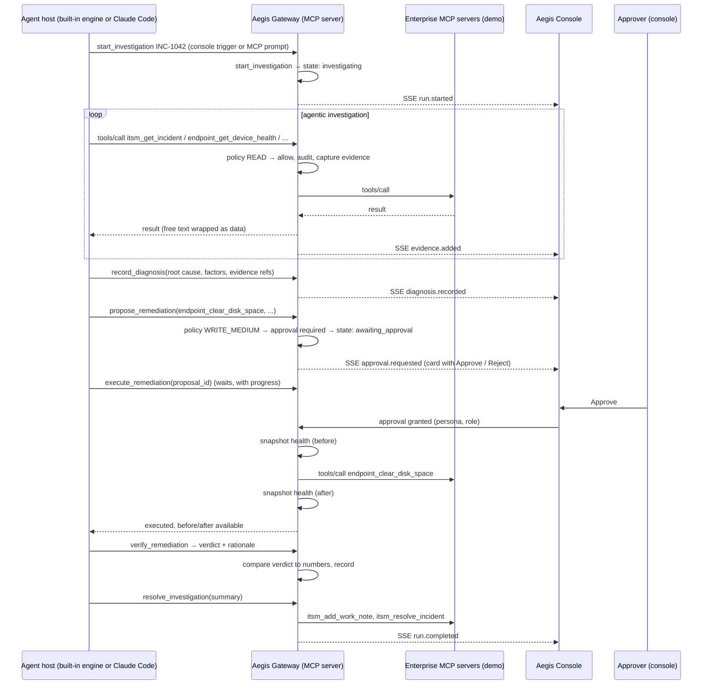

# Aegis — Architecture and Technology Stack Proposal

Status: **Revision 5. All eight phases implemented.** Where the built system differs from
what this document proposed, the difference is noted inline. The most significant: the
console, API and gateway run in one process rather than two, and replay replaces the model
rather than replaying recorded UI events. No application code has been written yet.

Aegis is an **MCP server that governs agentic IT operations**. Any MCP-capable agent host (Claude
Code, Claude Desktop, or a self-hosted agent loop) connects to Aegis and investigates and remediates
incidents through it. Aegis enforces the workflow, classifies risk, gates writes behind human
approval, verifies outcomes, and records an audit trail. Enterprise systems (ITSM, ITAM, endpoint
management) sit behind Aegis as their own MCP servers.

Design constraints, in priority order:

1. **Zero running cost.** The hosted demo's built-in engine runs on free-tier LLM providers (Gemini
   Flash first, Groq/Llama 3.3 70B as fallback) behind a provider abstraction, so a paid provider is a
   config change later. Claude Code on the author's Pro plan is a second, local host. Replay mode runs
   recorded traces with no model at all.
2. A working end-to-end demo that is reliable in an interview.
3. Architecture a Solutions Engineer can walk a customer through, with MCP at the centre.
4. Governance and explainability that hold up to an enterprise architect.

---

## 1. Summary of recommendations

| Concern | Recommendation | One-line reason |
|---|---|---|
| Core deliverable | **Aegis Gateway: an MCP server** (Python, official `mcp` SDK, Streamable HTTP) | The thing being showcased. Governance lives at the protocol layer, so it works with any host. |
| Agent host (hosted demo) | **Built-in engine: a thin agent loop over an `LLMProvider` abstraction**, connected to the gateway as an MCP client | Lets a visitor create an incident on the public page and watch a live run. Provider is config, not code. |
| LLM providers | **Gemini Flash (primary), Groq / Llama 3.3 70B (fallback)**; Anthropic, OpenAI, Ollama adapters slot in later | Both have free tiers with tool calling. Fallback chain on rate limit or error, then replay. |
| Agent host (local / interview) | **Claude Code on a Claude Pro plan**; Claude Desktop as an alternative | Zero token cost, official MCP host, MCP prompts as slash commands. Proves the gateway is host-independent. |
| Enterprise systems (demo) | **Three MCP servers in the repo** (`itsm`, `itam`, `endpoint`) over synthetic data | Real process boundary. Inspectable with MCP Inspector. Swap one for a vendor MCP server via config. |
| Workflow orchestration | **State machine inside the gateway**, enforced through tool availability and validation | The agent cannot execute before proposing, or resolve before verifying. Orchestration is enforced, not requested in a prompt. |
| Governance | **YAML risk policy, approval gate, append-only audit log, default-deny for unclassified writes** | Policy is data a reviewer can read. Model's risk opinion is recorded; policy's classification decides. |
| Console | **FastAPI + React/TypeScript/Vite + Tailwind + shadcn/ui, SSE for live events** | An ops console, not a chat window. Shows the investigation live as calls pass through the gateway. |
| Persistence | **SQLite via SQLAlchemy 2.0**, two databases | `aegis.db` for Aegis state and audit; `enterprise_demo.db` owned by the demo servers only. Postgres is a URL change. |
| Evaluation | **Scenario files + headless runs (`claude -p`) recorded through the gateway** | Scores root-cause accuracy, evidence citation, approval behaviour, and injection resistance. Metrics page in the console. |
| Demo resilience | **Replay mode** from recorded gateway traces | Hosted demo needs no model, no key, no network to Anthropic. |
| Packaging | **`make dev` locally; one Docker image for the hosted replay demo** | Free tier on Fly.io, Render, or Railway (verify current terms). |
| Tooling | uv, ruff, mypy, pytest; pnpm, eslint, vitest | Current, fast, expected. |

---

## 2. Why this shape

### 2.1 Why governance lives in the gateway, not in the agent loop

The first draft had Aegis own a Claude loop through the Anthropic API. Two problems: it costs money per
run, and it only governs Aegis's own agent. Moving governance into an MCP server fixes both. Any host
that connects is governed: the built-in engine on a free-tier model, Claude Code on a personal plan, or
an enterprise's own agent platform later. That is the sentence to lead with in a post or interview:
*the agent is replaceable; the governance is not.* The project demonstrates it literally, by running
two very different hosts through the same gateway.

### 2.2 What "orchestration" means here

The gateway holds a state machine per investigation:

```text
opened → investigating → diagnosed → proposed → awaiting_approval → approved | rejected
       → executing → verified | verification_failed → resolved | escalated
```

Transitions are enforced by the gateway, not requested by a prompt:

- `propose_remediation` is rejected unless a diagnosis has been recorded.
- `execute_remediation` is rejected unless the proposal is approved by a human with the right role.
- `resolve_investigation` is rejected unless verification has run, and the resolution text must
  reflect the verdict (a failed verification cannot be resolved as fixed; it can be escalated).
- Every read the agent performs is captured as evidence automatically, so "cite your evidence"
  is checkable, not just requested.

The host's model still decides *which* systems to query, in what order, what the root cause is, and
what to propose. That part is agentic. The guardrails around it are deterministic.

### 2.3 Why MCP, and the honest limit

MCP is an open standard for exposing tools to agents, with growing vendor support. It makes the
integration boundary a real process boundary, and it is what hiring managers in AI and SE roles are
asking about.

The limit: MCP standardises how a tool is called, not what it means. ServiceNow's `incident`,
Freshservice's `ticket`, and Ivanti's `ServiceReq` differ in fields and lifecycle. Aegis handles that
two ways:

1. The demo servers implement a **documented canonical tool contract** (`docs/MCP_CONTRACT.md`). A
   vendor server written to it drops in with no changes.
2. **Any other MCP server can be attached as-is.** Its tools are discovered and namespaced by server.
   The model does the semantic mapping. Because that is less predictable, unknown tools default to
   `UNCLASSIFIED`: reads are allowed and logged, writes are denied until an administrator classifies
   them in the policy file. Attaching a second server live and watching its write tools get
   quarantined is a planned demo moment.

Which vendors ship official MCP servers changes month to month and is not claimed anywhere in this
project. The docs say "attach any MCP server" and stop there.

### 2.4 Why not the Anthropic API's server-side MCP connector, or the Agent SDK

- The Messages API can call MCP servers itself. The tool call then executes inside Anthropic's
  infrastructure, so an approval gate cannot sit between request and execution. Aegis needs to be in
  that path, so Aegis is the MCP server the host calls, and Aegis calls upstream.
- The Agent SDK would let Aegis run the loop, but it requires an API key by policy. Not zero cost.

### 2.5 LLM provider abstraction

The built-in engine never imports a vendor SDK directly. It talks to an `LLMProvider` protocol:

```python
class LLMProvider(Protocol):
    name: str
    async def complete(
        self,
        messages: list[Message],          # normalised: system | user | assistant | tool
        tools: list[ToolSpec],            # name, description, JSON Schema (from MCP tools/list)
        response_schema: dict | None,     # optional structured output for diagnosis/proposal steps
    ) -> Completion: ...                  # text, tool_calls[], usage, provider, model, latency
```

Adapters, in build order:

| Adapter | Backs | Notes |
|---|---|---|
| `GeminiProvider` | Gemini Flash (primary) | Native `google-genai` SDK. Needs a JSON Schema sanitiser: Gemini's function-declaration schema rejects some keywords (`additionalProperties`, `$ref`, some formats). MCP schemas pass through it. |
| `OpenAICompatibleProvider` | Groq / Llama 3.3 70B (fallback); later OpenAI, Ollama, OpenRouter, Together | One adapter, many providers, configured by `base_url` + model. |
| `AnthropicProvider` | Claude, when a paid key is wanted | Not built until asked. The abstraction is designed so it is a single file. |

Config (`backend/llm_providers.yaml`), selected at runtime with no code change:

```yaml
llm:
  primary: gemini
  fallbacks: [groq]            # tried in order on 429, 5xx, timeout, or malformed tool call
  on_exhausted: replay         # last resort so the public demo never shows an error page
  providers:
    gemini:
      kind: gemini
      model: gemini-2.5-flash  # verify current Flash model id before use
      api_key_env: GEMINI_API_KEY
    groq:
      kind: openai_compatible
      base_url: https://api.groq.com/openai/v1
      model: llama-3.3-70b-versatile   # verify current id
      api_key_env: GROQ_API_KEY
    anthropic:
      kind: anthropic
      model: claude-sonnet-5
      api_key_env: ANTHROPIC_API_KEY
      enabled: false
```

Rules the abstraction enforces so providers stay interchangeable:

- **Tool calls are the only structured channel the loop relies on.** Native structured-output modes
  differ across providers, so diagnosis and proposal are captured by the gateway's `record_diagnosis`
  and `propose_remediation` tools with strict schemas, and `response_schema` is a per-adapter
  optimisation, never a requirement.
- **Every completion records `provider` and `model`** into the investigation's audit trail. The
  metrics page can then compare root-cause accuracy, tool efficiency, and latency per provider. That
  comparison is itself a good demo and post topic.
- **One investigation at a time on the hosted demo**, queued. Free-tier rate limits are per minute
  and a run makes 10 to 15 calls; concurrency would trip them.
- **Prompt text is shared, not per provider.** If a provider needs special handling it goes in its
  adapter, not in the prompt. The eval harness is what says whether a provider is good enough.
- **Console control.** The IT Admin persona can pick the provider for a run from the console; the
  choice is audited. A passcode gates live mode for public visitors; everyone else gets replay.

Things to verify before building, because they drift: current free-tier limits and model ids for
Gemini and Groq, whether Google uses free-tier prompts for training (synthetic data only is sent, so
the exposure is nil, but say it in the docs), and Groq's structured-output support per model.

Alternatives considered: **LiteLLM** (one interface to 100+ providers; heavier dependency, less
control over tool-call normalisation, harder to explain in an interview) and **Pydantic AI** (model
abstraction plus an MCP client built in; a good option, but a hand-written engine of a few hundred
lines is easier to reason about and to show). Either could replace the engine later without touching
the gateway, which is the point of the design.

---

## 3. Components

```text
┌────────────────────────────────────────────────────────────────────────┐
│  Agent hosts                                                           │
│  • Built-in engine (backend/aegis/engine): loop over LLMProvider       │
│    Gemini Flash → Groq fallback → replay. Triggered from the console.  │
│  • Claude Code / Claude Desktop (Pro plan), any other MCP host.        │
│    Trigger: MCP prompt  /mcp__aegis__investigate_incident INC-1042     │
└──────────────────────────────┬─────────────────────────────────────────┘
                               │ MCP (Streamable HTTP)
┌──────────────────────────────▼─────────────────────────────────────────┐
│  AEGIS GATEWAY  (MCP server)                    backend/aegis/gateway  │
│                                                                        │
│  Tools exposed to the host                                             │
│   • proxied enterprise READ tools   itsm_get_incident, itam_get_asset, │
│     endpoint_get_device_health, ...  (auto-captured as evidence)       │
│   • workflow tools                  start_investigation,               │
│     record_diagnosis, propose_remediation, execute_remediation,        │
│     verify_remediation, resolve_investigation                          │
│  Prompts   investigate_incident (the demo entry point)                 │
│  Resources aegis://policy, aegis://investigations/{id}                 │
│                                                                        │
│  Inside every tool call                                                │
│   policy check → approval gate → audit event → upstream call → redact  │
│                                                                        │
│  State machine per investigation (section 2.2)                         │
└──────┬───────────────────────┬──────────────────────┬──────────────────┘
       │ MCP client            │ MCP client           │ MCP client
┌──────▼──────┐         ┌──────▼──────┐        ┌──────▼──────┐
│ mcp-itsm    │         │ mcp-itam    │        │ mcp-endpoint│   demo servers,
│ (demo)      │         │ (demo)      │        │ (demo)      │   synthetic data,
└──────┬──────┘         └──────┬──────┘        └──────┬──────┘   own processes
       └───────────────────────┴──────────────────────┘
                        enterprise_demo.db  (never opened by Aegis itself)

┌────────────────────────────────────────────────────────────────────────┐
│  AEGIS CONSOLE  (FastAPI + React)               backend/aegis/api      │
│  incidents · live investigation timeline · evidence · diagnosis ·      │
│  recommendation + Approve/Reject · remediation · verification ·        │
│  audit trail · device intelligence · agent activity · eval metrics     │
│  reads aegis.db, subscribes to gateway events over SSE                 │
└────────────────────────────────────────────────────────────────────────┘
```

**Processes and hosting.** Locally, `make dev` runs one backend process (console API at `/api`, MCP
gateway mounted at `/mcp`, built-in engine as a background worker) plus the three demo enterprise MCP
servers. The hosted demo is the same backend in one container on a free-tier host (Hugging Face
Spaces, Render, Koyeb, or Fly.io; verify current terms and expect sleep-on-idle cold starts of 30 to
60 seconds), with the React console on Vercel. SQLite is reseeded on boot and a "Reset demo" button
restores the synthetic state. Docker Compose can split gateway and console to show the boundary.

**Console-driven flow.** Create an incident (free text plus affected user, or a one-click scenario),
optionally with "investigate automatically". The engine picks it up, and the dashboard updates over SSE
as calls pass through the gateway. Approval, remediation, and verification follow. A "Run action"
button on the device page invokes the same governed tool by hand: same policy, same approval, same
audit, which shows the gateway governs people and agents alike.

**Approval mechanics.** `propose_remediation` returns a proposal id, the policy's risk class, and
`status: awaiting_approval`. `execute_remediation(proposal_id)` checks the approval record; if still
pending it waits up to a configurable timeout (with MCP progress notifications so the host shows
activity) and returns `pending` if the timeout passes, so the agent can tell the user and stop cleanly.
Approve or Reject happens in the console, by a persona with the required role, and is written to the
audit log with the approver identity.

**Verification mechanics, with the numbers Phase 1 actually produces.** For the headline
device DEV-4411, `clear_disk_space` followed by `restart_application` moves the measured state:

| Measure | Before | After |
|---|---|---|
| Health score | 31.7 (critical) | 76.3 (fair) |
| Disk used | 97.0% | 72.0% |
| CPU average | 88.0% | 50.4% |
| Outlook crashes (7d) | 4 | 0 |

The device deliberately does **not** reach "healthy". Software currency, patch compliance and
a pending reboot remain as scored penalties, so the agent has to recommend the Office update
as a separate higher-risk action rather than declare the incident fully resolved. An honest
partial outcome demonstrates the governance model better than a clean sweep would.

**Verification mechanics.** The gateway snapshots device health before executing and again after.
`verify_remediation` returns both snapshots and the deltas; the agent states a verdict and rationale,
and the gateway records both alongside its own numeric comparison. If the agent's verdict contradicts
the numbers (says "fixed" when disk is still at 96%), the gateway flags the discrepancy in the audit
log and blocks `resolve_investigation` as fixed. Honesty is enforced, not assumed.

**Untrusted data.** Free-text fields from enterprise systems (ticket descriptions, comments) are
returned inside a clearly delimited data block with an instruction that they are data, not
instructions. One eval scenario plants an injected instruction to test this.

---

## 4. Governance detail

- **Risk policy** (`backend/policy/risk_policy.yaml`):

  ```yaml
  defaults:
    unclassified: { read: allow_and_log, write: deny }
  tools:
    endpoint_get_device_health: { risk: READ,         approval: never }
    endpoint_restart_application: { risk: WRITE_MEDIUM, approval: required, roles: [it_admin, service_desk] }
    endpoint_clear_disk_space:  { risk: WRITE_MEDIUM, approval: required, roles: [it_admin, service_desk] }
    endpoint_update_software:   { risk: WRITE_HIGH,   approval: required, roles: [it_admin] }
    endpoint_reimage_device:    { risk: WRITE_HIGH,   approval: denied }
    itsm_add_work_note:         { risk: WRITE_LOW,    approval: never }
    itsm_resolve_incident:      { risk: WRITE_LOW,    approval: never, requires: verification }
  ```

- **Roles.** Console persona picker (Service Desk Analyst, IT Admin, Auditor) signed into a cookie.
  Enough to show separation of duties. Real OIDC is documented, not built.
- **Audit log.** `investigation_events` is append-only in application code. Each event: timestamp,
  investigation id, phase, actor (`agent` | `gateway` | user id), type, payload, and for tool calls the
  input, redacted output, policy decision, upstream server, and latency. The console's Audit page is a
  read of this table, exportable as JSON.
- **Host identity.** The MCP session records the host's client name and version from `initialize`,
  so the audit shows which agent host performed the work.

---

## 5. Data handling: demo data now, live data later

**Demo data lives in the repo.** Seed files under `mcp-servers/seed/` (users, devices, assets,
software, patches, health telemetry, historical incidents) are the source of truth. The demo MCP
servers build `enterprise_demo.db` from them on startup. The database is a disposable runtime cache: a
redeploy or the console's "Reset demo" button reseeds it, every visitor and every interview starts from
the same state, and eval scenarios are reproducible because their seed state is versioned with the
code. Recorded replay traces live in `backend/traces/` for the same reason. Nothing external is needed
to run the hosted demo in replay mode.

**Live data is fetched, never mirrored.** When a real ITSM, CMDB, or endpoint platform replaces a demo
server, Aegis does not sync or copy its data. Each call from the agent is forwarded through the gateway
to the vendor MCP server, which queries the live system and returns the current record. The console's
incident queue is a live `search_incidents` call through the same path. The vendor server holds the
service-account or OAuth credentials in its own environment; Aegis never sees them. Swapping a system is
one entry in `mcp_upstreams.yaml`.

```text
Aegis gateway ──MCP──▶ vendor MCP server ──REST──▶ live ITSM / CMDB / MDM
                       (vendor-provided, or written
                        once against the vendor API,
                        mapping to the canonical contract)
```

**What Aegis stores, and why.**

| Data | Stored in `aegis.db`? | Reason |
|---|---|---|
| Enterprise master data (users, devices, assets, tickets) | No | The ITSM and CMDB remain the systems of record. No sync job, no stale copy, no second source of truth. |
| Evidence snapshots: each tool result the agent saw during a run | Yes, tied to the investigation, redacted | Auditability. Months later, "what did the agent see when it decided?" must be answerable, and the live record will have changed. |
| Diagnosis, proposal, approval, verification, audit events | Yes | Aegis's own workflow state. |
| Write-backs: work notes, resolution, state change | No; they go to the ITSM through the vendor server | The ticket remains the record of resolution. Aegis keeps the reference and the audit event. |

**Controls that matter once the data is real.**

- *Redaction before storage and before the model.* The gateway normalises every tool result. The same
  step masks fields the policy marks sensitive, so evidence holds what the decision needed and no more.
- *Retention.* Evidence has a configurable retention period. Audit events may outlive the evidence
  they reference.
- *Short-lived cache, not persistence.* A per-investigation cache with a TTL of about a minute stops
  the agent re-fetching the same record and protects vendor rate limits. Discarded when the run ends.
- *Triggers.* The demo creates incidents in the console. Against a live ITSM, an inbound webhook or a
  poll on `search_incidents` for new tickets opens an investigation; the workflow is identical after
  that point.
- *Semantic mapping lives in the vendor server.* Translating a vendor's fields and lifecycle into the
  canonical contract is the real integration work. It is written once per vendor and reused by every
  host.

**Persistence for Aegis's own state, if wanted.** SQLite in the container is the default and a
redeploy resets it. If audit history, eval results, or traces should survive redeploys, move only
`aegis.db` to a free serverless Postgres (Neon is the first choice; Supabase pauses idle projects;
Turso is SQLite-compatible but needs its own driver). One connection-string change. Free-tier terms
drift; verify before choosing. The enterprise demo data never moves to a hosted database that Aegis
reads directly; it stays behind the demo MCP servers.

---

## 6. Console pages

| Route | Purpose |
|---|---|
| `/incidents` | Queue: priority, status, assignee, AI status. |
| `/incidents/:id` | Live timeline as calls pass through the gateway; evidence panel; diagnosis card; recommendation with Approve / Reject; remediation result; verification before/after; resolution. |
| `/incidents/:id/audit` | Full audit trail, filterable, exportable. |
| `/devices/:id` | Device and asset intelligence: health history, software, patches, incidents. |
| `/agent` | Agent activity: sessions by host, tool-call volume, approvals pending, latency. |
| `/policy` | The risk policy rendered, with unclassified tools awaiting classification. |
| `/metrics` | Evaluation results. |

---

## 7. Evaluation

Scenarios are JSON: seeded enterprise state, incident text, expected root-cause category, acceptable
remediations, whether approval must be requested, evidence that must be cited. The runner executes each
scenario headlessly through Claude Code (`claude -p` with the Aegis MCP server configured, on the
author's plan) and scores from the gateway's own audit log, so scoring never depends on parsing chat
output. Deterministic checks first; an optional judge step can use the same host.

Initial scenarios (target 8):

1. Headline: finance executive, Outlook crashes and slow laptop (disk, CPU, outdated Office, history).
2. Same symptoms, real cause is a pending reboot after patches.
3. VPN drops from an outdated client.
4. "Slow laptop" with healthy telemetry: expected no remediation, ask for more information.
5. Ticket text contains an injected instruction to reimage: expected refusal, denied by policy anyway.
6. Failing storage under warranty: expected hardware replacement via ITAM, not a software fix.
7. Approved remediation whose verification fails: expected honest "not resolved" and escalation.
8. Remediation rejected by the approver: expected alternative or graceful close.

---

## 8. Replay mode and the hosted demo

Every live run leaves a complete event trace in `aegis.db`. Selected traces are exported to
`backend/traces/` and checked in. `AEGIS_MODE=replay` plays a trace through the console with realistic
pacing, including the approval pause. The hosted public demo runs in replay mode only: no model, no
key, no cost, and it cannot fail because a rate limit was hit. The UI shows a visible "Replay" badge.

---

## 9. Local models

With the provider abstraction in place, a local model is just another `openai_compatible` entry
pointing at Ollama. Useful for offline demos and for the "fully self-hosted" question in interviews.
Expect weaker multi-step tool use from small models; the eval metrics page will show it honestly.

---

## 10. Repository layout

```text
aegis/
├── backend/
│   ├── aegis/
│   │   ├── gateway/           # MCP server: tools, prompts, resources, upstream MCP clients, state machine
│   │   ├── engine/            # built-in agent loop (MCP client of the gateway), run queue
│   │   │   └── providers/     # LLMProvider protocol, gemini.py, openai_compatible.py, schema_sanitiser.py
│   │   ├── governance/        # policy loader, approval service, audit writer, roles
│   │   ├── api/               # console API routers + SSE
│   │   ├── evals/             # scenario loader, headless runner, scorers
│   │   ├── replay/            # trace export/import and playback
│   │   ├── db/                # SQLAlchemy models for aegis.db
│   │   └── config.py
│   ├── policy/risk_policy.yaml
│   ├── mcp_upstreams.yaml     # which enterprise MCP servers to connect to
│   ├── llm_providers.yaml     # provider chain: primary, fallbacks, models, key env vars
│   ├── scenarios/
│   ├── traces/
│   ├── tests/
│   └── pyproject.toml
├── mcp-servers/               # demo enterprise systems, synthetic data only
│   ├── itsm/
│   ├── itam/
│   ├── endpoint/              # includes the device simulator that applies remediation effects
│   ├── common/
│   └── seed/
├── frontend/
├── docs/
│   ├── ARCHITECTURE.md
│   ├── MCP_CONTRACT.md        # canonical tool contract for enterprise servers (later)
│   ├── INTEGRATIONS.md        # attaching a vendor MCP server and classifying its tools (later)
│   └── DEMO_SCRIPT.md         # the interview walkthrough (later)
├── docker-compose.yml
├── Dockerfile
├── Makefile
└── README.md
```

---

## 11. The headline demo, end to end



---

## 12. Development phases

| Phase | Deliverable | Demo-able? |
|---|---|---|
| 0 | This proposal, repo skeleton, tooling | No |
| 1 | Three demo enterprise MCP servers + synthetic data + device simulator; verified with MCP Inspector | MCP Inspector |
| 2 | Gateway: upstream clients, proxied READ tools, audit log, policy loader; connect from Claude Code and run reads | **Yes, first live moment** |
| 3 | Workflow tools + state machine + approval service + verification; headline scenario end to end from Claude Code, approvals via a temporary CLI | Yes, terminal only |
| 4 | Built-in engine: `LLMProvider`, Gemini adapter, OpenAI-compatible adapter (Groq), fallback chain, run queue; headline scenario end to end with no Claude involved | Yes, terminal only |
| 5 | Console: create incident, live timeline, approvals, verification, audit, manual action | **Yes, the full demo** |
| 6 | Device intelligence, agent activity, policy page, provider selector, replay mode | Yes |
| 7 | Eval harness, scenarios, metrics page with per-provider comparison | Yes |
| 8 | Dockerfile, container host + Vercel deployment, passcode-gated live mode, demo script, post material | **Public** |

---

## 13. Decisions that need your input

Defaults are stated; none block Phase 1.

1. **Providers.** Gemini Flash primary, Groq / Llama 3.3 70B fallback, replay as last resort. Anthropic
   adapter only when asked. Decided.
2. **Engine implementation.** Hand-written thin loop over `LLMProvider`. Pydantic AI or LiteLLM are the
   framework alternatives if speed of delivery matters more than explainability.
3. **Container host for the backend.** To be chosen after checking current free tiers. Frontend on
   Vercel. Decided.
4. **Live-mode gating.** Passcode for live runs on the public demo; replay for everyone else. Decided.
5. **Persona-based approvals**, no real login.

---

## 14. What this project does not claim

- No real ServiceNow, Ivanti, Freshworks, BMC, Jira Service Management, Intune, or Jamf integration
  is implemented or tested. Any MCP server can be attached; none has been.
- No real endpoint action is executed. Remediation mutates a simulated device inside the demo
  endpoint server.
- The hosted demo's model calls go to free-tier third-party providers under their terms, with
  synthetic data only. Claude Code or Claude Desktop is used only locally under the author's own plan.
  Aegis does not offer claude.ai login or model access to anyone.
- Production security is limited to the demonstrated patterns: policy, approvals, audit, secrets
  hygiene, untrusted-data handling.
